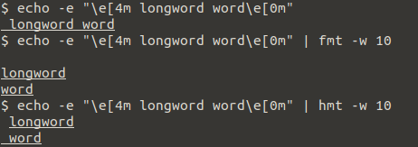

# hmt

``hmt`` is a simple wrapper around [fmt](https://www.gnu.org/software/coreutils/manual/coreutils.html#fmt-invocation) that allows to "correctly" format escape sequences.


``hmt`` can be used exactly like ``fmt``.
However, input text is only read from STDIN.

```bash
$ cat myfile | hmt <any option for fmt except FILE>
```

``hmt`` execpts ``fmt`` to be in your ``PATH``.

# Install / Download

Get [Haskell Stack](https://docs.haskellstack.org/en/stable/README/) and run

```bash
$ make release
```

Alternatively, download a binary from the release page.

# Implemenation

``hmt`` is written in Haskell (because of reasons).
All escape sequences are removed from the input text and the remainder is feeded into ``fmt``.
The previously removed escape sequences are then inserted again into ``fmt``'s output.

Currently, ``hmt`` is really only a simple wrapper.
Running ``hmt --help`` will actually yield ``fmt``'s help message!

## Known Bugs

The formated text will contain a different number of whitespaces (newlines, spaces) and ``hmt`` is not always able to put the escape sequence back to the expected locations.



Note how both ``fmt`` as well as ``hmt`` are wrong but in different ways.
