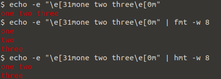

# hmt

``hmt`` is a simple wrapper around [fmt](https://www.gnu.org/software/coreutils/manual/coreutils.html#fmt-invocation) that allows to "correctly" format escape sequences.



# Usage

``hmt`` can be used exactly like ``fmt``.

A word of caution:
``fmt`` expects any non-option command line to be a file and tries to open it.
The same holds for ``hmt``.
However, ``hmt`` simply forwards any non-file command line option/argument to ``fmt`` without checking whether this was actually and option/argument or not.

# Prerequisites

``hmt`` expects ``fmt`` to be in your ``PATH``.

# Install / Download

Get [Haskell Stack](https://docs.haskellstack.org/en/stable/README/) and run

```bash
$ make release
```

Alternatively, download a binary from the [release page](https://github.com/rolfschr/hmt/releases).

# Implemenation

``hmt`` is written in Haskell (because of reasons).
All escape sequences are removed from the input text and the remainder is fed into ``fmt``.
The removed escape sequences are then inserted again into ``fmt``'s output.

Currently, ``hmt`` is really only a simple wrapper.
Running ``hmt --help`` will actually yield ``fmt``'s help message!
